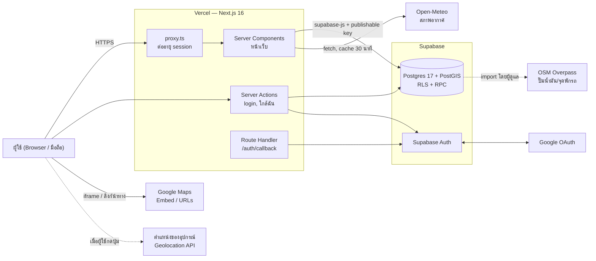
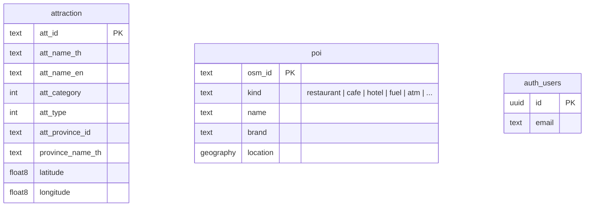

<p align="center"></p>

# ไทยไหนดี (aiattraction)

ไทยไหนดี — ค้นหาแหล่งท่องเที่ยวทั่วประเทศไทย พร้อมแผนที่ สภาพอากาศ ปั๊มน้ำมันและจุดแวะพักรถใกล้เคียง (Next.js 16 + Supabase, deploy บน Vercel)

โลโก้ต้นฉบับอยู่ที่ `brand/logo-source.webp` ถ้าเปลี่ยนโลโก้ ให้รัน `node scripts/generate-brand-assets.mjs` เพื่อสร้าง favicon, ไอคอนแอป, ภาพแชร์ลิงก์ (OG image) และโลโก้บนเว็บใหม่

## สถาปัตยกรรมระบบ (System Architecture)

### ภาพรวม



### เทคโนโลยีที่เลือกใช้

| ชั้น | เทคโนโลยี | เหตุผลที่เลือก | ข้อแลกเปลี่ยน |
| --- | --- | --- | --- |
| Frontend | Next.js 16 (App Router), React 19, Tailwind CSS 4, TypeScript, ฟอนต์ Noto Sans Thai | render ข้อมูลบน server ทำให้หน้าแรกเร็วและ SEO ดี (หน้าสถานที่ถูก index ได้) ส่ง JavaScript ไปที่ browser น้อย | ต้องทำตาม convention ใหม่ของ Next 16 เช่น `proxy.ts` และ `params` ที่เป็น async |
| Backend | ใช้ Next.js ฝั่ง server (Server Components, Server Actions, Route Handler) รันบน Vercel Functions ไม่แยก backend | codebase เดียว deploy อัตโนมัติเมื่อ push ไม่ต้องดูแล server เอง | ไม่เหมาะกับงานหนักหรือรันนาน เช่น import ข้อมูลทั้งประเทศ จึงย้ายงานพวกนี้ไปทำในฐานข้อมูล |
| Database | Supabase (Postgres 17) + PostGIS | Postgres ที่มีผู้ดูแลให้ มี Auth, REST/RPC และ RLS มาในตัว PostGIS ค้นหาจุดที่ใกล้ที่สุดได้ในราว 0.1–0.3 วินาที | ผูกกับบริการของ Supabase ถ้าต้องการย้ายออก ส่วน Postgres ย้ายได้ แต่ Auth ต้องเปลี่ยนใหม่ |
| Auth | Supabase Auth: อีเมล/รหัสผ่าน และ Google OAuth (PKCE) ผ่าน `@supabase/ssr` เก็บ session ใน cookie | ไม่ต้องทำระบบรหัสผ่านเอง ใช้ได้กับ Server Components | ต้องตั้ง SMTP เองเมื่อใช้งานจริง (อีเมลในตัวของ Supabase ส่งได้จำกัด) |
| Hosting | Vercel + GitHub integration | push ไป `main` แล้ว deploy อัตโนมัติ มี preview และ HTTPS ให้ และมี header ตำแหน่งจาก IP ให้ใช้ฟรี | แพ็กเกจ Hobby ใช้ได้เฉพาะงานที่ไม่ใช่เชิงพาณิชย์ |
| ข้อมูลภายนอก | Open-Meteo, OpenStreetMap (Overpass), Google Maps Embed/URLs | ฟรีและไม่ต้องใช้ key (Maps Embed ใช้ key ได้แต่ไม่บังคับ) | Open-Meteo ฟรีเฉพาะงานที่ไม่ใช่เชิงพาณิชย์ ข้อมูล OSM ขึ้นกับอาสาสมัคร |

### โมเดลการทำงาน

- **การ render:** ใช้ Server Components เป็นค่าเริ่มต้น หน้าเว็บ render ตามแต่ละ request เพราะใช้ `searchParams` และ cookie ส่วนการ์ดข้อมูลเสริม (สภาพอากาศ, ปั๊มน้ำมัน) โหลดแยกทีหลังด้วย `Suspense` ถ้าโหลดไม่สำเร็จ ส่วนอื่นของหน้ายังทำงานได้ ใช้ Client Component เฉพาะส่วนที่ต้องใช้ browser เช่น ตำแหน่งผู้ใช้และช่องเลือกที่ค้นหาได้
- **การเข้าถึงข้อมูล:** query ทั้งหมดอยู่ใน `src/lib/` ใช้ Supabase client 2 แบบ
  - `getSupabase()` สำหรับข้อมูล public แบบอ่านอย่างเดียว ไม่มี session ใช้ client ตัวเดียวร่วมกัน
  - `createAuthClient()` สำหรับงานของผู้ใช้ สร้างใหม่ทุก request เพราะผูกกับ cookie ของผู้ใช้คนนั้น
- **การค้นหาเชิงพื้นที่:** ใช้ RPC ใน Postgres (`nearby_attractions`, `nearby_poi`, `poi_along_route`, `attractions_along_route`, `search_places`) ร่วมกับ GiST และ trigram index ให้ฐานข้อมูลเรียงตามระยะทาง แทนการดึงข้อมูลทั้งหมดมาคำนวณในแอป
- **ข้อมูลภายนอก:**
  - สภาพอากาศเรียก API สดและ cache 30 นาทีต่อพื้นที่ราว 1 กม.
  - ปั๊มน้ำมันและจุดพักรถดึงมาเก็บในฐานข้อมูลล่วงหน้า (batch import) เพราะ Overpass ช้าและไม่เสถียรเกินกว่าจะเรียกทุกครั้งที่มีคนเปิดหน้า
- **ตำแหน่งผู้ใช้:** ขอเมื่อผู้ใช้กดปุ่มเท่านั้น ไม่ใส่ใน URL และไม่บันทึกลงฐานข้อมูล ระยะทางในหน้ารายละเอียดคำนวณใน browser ถ้าหาจากอุปกรณ์ไม่ได้ มีทางสำรองเป็นตำแหน่งโดยประมาณจาก IP (header ของ Vercel)

### Data model



- `attraction` (ประมาณ 8,600 แถว) นำเข้าจากระบบภายนอก แอปจึงไม่แก้ column ของตารางนี้ ทำ spatial index แบบ expression บน latitude/longitude แทนการเพิ่ม column
- view `attraction_type_options` และ `attraction_province_options` ใช้เป็นตัวเลือกในตัวกรอง (ตั้ง `security_invoker` ให้เคารพ RLS ของตารางต้นทาง)
- `poi` (ประมาณ 91,000 แถว: ร้านอาหาร คาเฟ่ ที่พัก พิพิธภัณฑ์ ATM ร้านยา โรงพยาบาล ปั๊มน้ำมัน จุดพักรถ ที่จอดรถ ห้องน้ำ) นำเข้าจาก OSM ด้วย `import_poi(group)` เรียกได้เฉพาะผู้ดูแล
- `provinces` (77 จังหวัด พร้อมธงเมืองรอง 55 จังหวัด), `place_groups` + `attraction_type_group` (13 หมวดพร้อมค่าความเหนื่อย), `admin_areas` (อำเภอ/ตำบลสำหรับค้นหา)
- `profiles`, `trips`, `trip_days`, `trip_items`, `trip_bookings` เป็นข้อมูลของผู้ใช้ RLS ให้เห็นเฉพาะของตัวเอง
- `auth.users` Supabase จัดการให้ ตอนนี้ยังไม่มีตารางข้อมูลของผู้ใช้เพิ่มเติม
- migration ทั้งหมดอยู่ใน `supabase/migrations/`

### ความปลอดภัย

- **สิทธิ์ในฐานข้อมูล:** ทุกตารางเปิด RLS สิทธิ์ public เป็นอ่านอย่างเดียว (ต้องตั้งทั้ง policy และ `grant`) ไม่มีการเขียนจากฝั่ง public
- **Key:** แอปใช้แค่ publishable key ไม่มี secret key อยู่ในโค้ดหรือ repo
- **ฟังก์ชันของผู้ดูแล:** `import_poi` และ trigger `handle_new_user` ถอนสิทธิ์ `execute` จาก anon และ authenticated แล้ว
- **ข้อมูลของผู้ใช้:** ตาราง trip ทุกตารางตรวจทั้ง `user_id` และว่าแถวแม่เป็นของผู้ใช้คนเดียวกัน (สร้างวันหรือรายการผูกกับทริปของคนอื่นไม่ได้)
- **Redirect:** หลัง login redirect ได้เฉพาะ path ภายในเว็บ (กัน open redirect)
- **ข้อมูลจากฐานข้อมูล:** ลิงก์ภายนอกผ่าน `toExternalUrl()` ก่อนใช้ HTML จากฐานข้อมูลแปลงเป็นข้อความธรรมดาด้วย `htmlToText()` ไม่ render เป็น HTML ตรง ๆ

### AI model

ตอนนี้ระบบยังไม่ได้ใช้โมเดล AI ถ้าจะเพิ่มฟีเจอร์ AI เช่น ผู้ช่วยวางแผนทริปหรือค้นหาด้วยภาษาธรรมชาติ แนะนำแนวทางนี้:
- เรียก Claude (Anthropic API) จากฝั่ง server ผ่าน Server Action หรือ Route Handler เก็บ API key เป็น env ฝั่ง server
- ให้ AI ตอบจากข้อมูลจริงในตาราง `attraction` (RAG) ด้วย pgvector ใน Supabase หรือให้โมเดลเรียกฟังก์ชันค้นหาที่มีอยู่แล้ว (`searchAttractions`, `getNearbyAttractions`) ผ่าน tool use
- เลือกรุ่นโมเดลให้เหมาะกับงาน: งานที่ต้องคิดซับซ้อนใช้รุ่นใหญ่ งานง่ายที่ใช้บ่อย เช่น จัดหมวดคำค้น ใช้รุ่นเล็กเพื่อลดค่าใช้จ่าย

### ข้อจำกัดและแนวทางพัฒนาต่อ

- **การค้นหาด้วยข้อความ:** ตอนนี้ใช้ `ILIKE` ถ้าข้อมูลเยอะขึ้น ควรเพิ่ม `pg_trgm` หรือ full-text search
- **คุณภาพข้อมูลต้นทาง:** ข้อความภาษาไทยบางแถวมีตัว `�` และชื่ออังกฤษบางแถวเป็นคำแทนค่าว่าง เช่น "ไม่มี" ควรแก้ที่สคริปต์ import
- **ข้อมูลปั๊มน้ำมันไม่อัปเดตเอง:** ต้องสั่งรีเฟรชเอง ตั้ง `pg_cron` ให้รันรายเดือนได้
- **ยังไม่มีชุดทดสอบอัตโนมัติ:** ตอนนี้ตรวจแค่ lint และ build
- **ใช้งานเชิงพาณิชย์:** ถ้าจะใช้เชิงพาณิชย์ ต้องเปลี่ยนแพ็กเกจ Vercel และ Open-Meteo และตั้ง SMTP สำหรับอีเมลยืนยัน

## เริ่มต้นใช้งาน (local)

```bash
npm install
cp .env.example .env.local   # ใส่ค่า Supabase URL และ publishable key
npm run dev                  # http://localhost:3000
```

## Environment variables

| ชื่อ | ที่มา |
| --- | --- |
| `SUPABASE_URL` | Supabase → Project Settings → API → Project URL |
| `SUPABASE_PUBLISHABLE_KEY` | Supabase → Project Settings → API Keys → Publishable key (`sb_publishable_...`) |

## ฐานข้อมูล

ใช้ตาราง `public.attraction` ใน Supabase project `ai-system`
SQL ที่แอปต้องใช้ (สิทธิ์อ่านแบบ public และ view สำหรับตัวกรอง) อยู่ใน `supabase/migrations/`

## Deploy ขึ้น Vercel

1. Push repo นี้ขึ้น GitHub
2. ไปที่ https://vercel.com/new → Import `aiattraction` (Vercel ตรวจเจอ Next.js ให้อัตโนมัติ)
3. ใส่ Environment Variables ทั้งสองตัวด้านบน (ถ้าเชื่อม Supabase Integration ใน Vercel ไว้ จะมีให้อัตโนมัติ) → Deploy

หลังจากนั้นทุกครั้งที่ push ไป `main` Vercel จะ deploy ให้อัตโนมัติ

## แหล่งข้อมูลภายนอก

| ข้อมูล | แหล่งที่มา | หมายเหตุ |
| --- | --- | --- |
| แผนที่ | Google Maps embed | ใส่ `GOOGLE_MAPS_API_KEY` (ไม่บังคับ) เพื่อใช้ Maps Embed API |
| สภาพอากาศ | [Open-Meteo](https://open-meteo.com/) | ไม่ต้องใช้ key, cache 30 นาที, ฟรีสำหรับการใช้งานที่ไม่ใช่เชิงพาณิชย์ |
| ร้านอาหาร ที่พัก ปั๊มน้ำมัน ATM ร้านยา ฯลฯ | OpenStreetMap ผ่าน Overpass API | เก็บในตาราง `poi` (ODbL, © OpenStreetMap contributors) |
| ราคาน้ำมัน | ปตท. (`CurrentOilPrice` SOAP) ราคากรุงเทพฯ | cache 1 วัน ถ้าเรียกไม่ได้ใช้ราคาตั้งต้นและแจ้งผู้ใช้ |

รีเฟรชข้อมูล POI จาก OSM (รันใน Supabase SQL Editor ทีละกลุ่ม กลุ่มใหญ่ใช้เวลาหลายนาที ถ้า server ตอบ 429/504 ให้รอหรือเปลี่ยน endpoint):

```sql
set statement_timeout = 0;
select public.import_poi('car', 'https://overpass-api.de/api/interpreter');
-- กลุ่มอื่น: food, lodging, museum, finance, health, amenities
```

## เข้าสู่ระบบ (Supabase Auth)

รองรับอีเมล/รหัสผ่าน และ Google ตั้งค่าครั้งเดียวดังนี้

1. **Supabase → Authentication → URL Configuration**
   - Site URL: `https://thainhaidee.vercel.app`
   - Redirect URLs: `https://thainhaidee.vercel.app/**`, `http://localhost:3000/**`
   - ถ้าเปลี่ยนโดเมนเมื่อไร ต้องเพิ่มโดเมนใหม่ในรายการนี้ด้วย ไม่อย่างนั้น Supabase จะส่งผู้ใช้กลับไปที่ Site URL แทน
2. **Google Cloud Console → APIs & Services**
   - OAuth consent screen: ตั้งชื่อแอปและอีเมลติดต่อ, User type = External, กด Publish app
   - Credentials → Create credentials → OAuth client ID → Web application
     - Authorized JavaScript origins: `https://thainhaidee.vercel.app`
     - Authorized redirect URIs: `https://mdbnwbrugxrzigevudob.supabase.co/auth/v1/callback`
3. **Supabase → Authentication → Sign In / Providers → Google** เปิดใช้งาน แล้วใส่ Client ID และ Client Secret จากข้อ 2

4. **Facebook (Meta for Developers → https://developers.facebook.com/apps)**
   - Create App → เลือก use case "Authenticate and request data from users with Facebook Login"
   - Facebook Login → Settings → Valid OAuth Redirect URIs: `https://mdbnwbrugxrzigevudob.supabase.co/auth/v1/callback`
   - App settings → Basic: ใส่ App Domains `thainhaidee.vercel.app`, Privacy Policy URL แล้วสลับแอปเป็น **Live**
   - Permissions ที่ใช้: `email`, `public_profile`
   - **Supabase → Authentication → Sign In / Providers → Facebook** เปิดใช้งาน แล้วใส่ App ID และ App Secret

ถ้ายังไม่เปิด provider ไหน ปุ่มของ provider นั้นจะแจ้งให้ใช้วิธีอื่นแทน

หลังเข้าสู่ระบบครั้งแรก ระบบสร้างแถวใน `profiles` ให้อัตโนมัติ (เติมชื่อและรูปจาก Google/Facebook) แล้วพาไปหน้า `/profile` ให้กรอก วันเกิด เพศ จังหวัดบ้านเกิด (บอกเมืองหลัก/เมืองรอง) และอาชีพ
