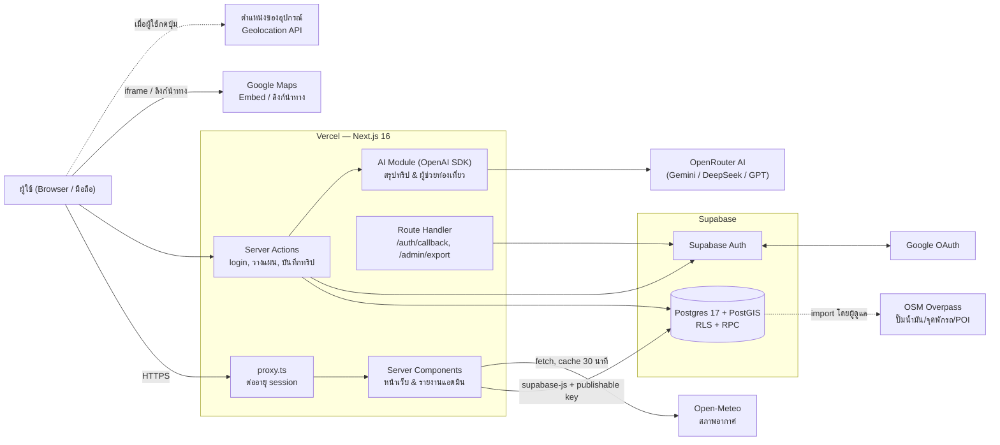
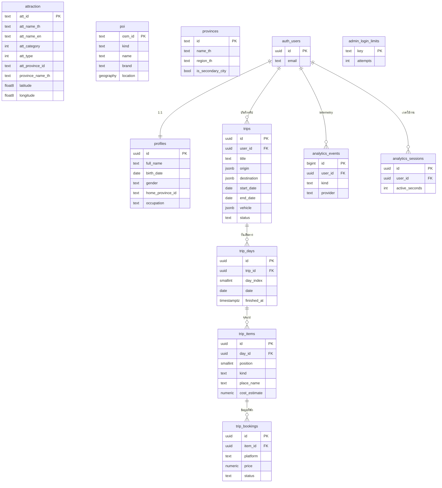

<p align="center"></p>

# ไทยไหนดี (aiattraction)

ไทยไหนดี — แพลตฟอร์มวางแผนท่องเที่ยวทั่วประเทศไทยแบบอัจฉริยะ (AI-assisted Travel Planner) ค้นหาแหล่งท่องเที่ยวและจุดแวะพักริมทาง คำนวณเส้นทางและค่าพลังงาน แนะนำที่พัก แผนที่นำทางสด พร้อมระบบรายงานสถิติหลังบ้าน (Next.js 16 + Supabase + PostGIS + OpenRouter AI, deploy บน Vercel)

โลโก้ต้นฉบับอยู่ที่ `brand/logo-source.webp` ถ้าเปลี่ยนโลโก้ ให้รัน `node scripts/generate-brand-assets.mjs` เพื่อสร้าง favicon, ไอคอนแอป, ภาพแชร์ลิงก์ (OG image) และโลโก้บนเว็บใหม่

---

## ฟีเจอร์หลัก (Key Features)

1. **ค้นหาและสำรวจแหล่งท่องเที่ยว (8,600+ แห่งทั่วไทย):**
   - ค้นหาสถานที่ท่องเที่ยว แหล่งเรียนรู้ ธรรมชาติ วัด ชุมชน พร้อมข้อมูลสภาพอากาศสดและปั๊มน้ำมันใกล้เคียง
   - รองรับการคัดกรองจังหวัดเมืองรอง 55 จังหวัดตามเกณฑ์ ททท. พร้อมระบบคำนวณระยะทางจากตำแหน่งผู้ใช้ (GPS หรือ IP)
2. **ระบบวางแผนเที่ยวอัจฉริยะ (`/plan`):**
   - วางแผนทริป 1–15 วัน เลือกรถและเชื้อเพลิง (เบนซิน, ดีเซล, แก๊สโซฮอล์, LPG, NGV, EV) เพื่อคำนวณระยะทาง ค่าน้ำมัน และเวลาขับรถล่วงหน้า
   - ปรับแต่งเส้นทาง (ทางหลักเร็วสุด, เส้นทางชมวิว, ชุมชน, ผสมผสาน) และเลือกรูปแบบเดินทางทั้งไป-กลับหรือเที่ยวเดียว
   - เพิ่ม/ลบ/สลับจุดแวะพัก ร้านอาหาร คาเฟ่ และสถานที่เที่ยวในแต่ละวันได้อย่างอิสระ
3. **AI ผู้ช่วยท่องเที่ยว & คำแนะนำเส้นทาง (OpenRouter AI):**
   - **AI Travel Assistant:** แชทบอทช่วยตอบคำถาม แนะนำที่เที่ยวเพิ่มเติม และปรับเวลาในทริป
   - **AI Route Advice ("AI แนะนำเส้นนี้"):** วิเคราะห์และเปรียบเทียบจุดเด่นของแต่ละเส้นทางให้ผู้ใช้ตัดสินใจง่ายขึ้น
   - **AI Safety & Prompt Injection Guard:** ระบบตรวจสอบความปลอดภัยในตัว ป้องกันการดึงคำสั่งระบบหรือข้อมูลส่วนตัว
4. **แผนที่และจัดการที่พักรายวัน (Phase 6):**
   - แผนที่แสดงจุดแวะและเส้นทางขับรถในแต่ละวันด้วย Leaflet + OpenStreetMap
   - ระบบเปรียบเทียบราคาและบันทึกสถานะการจองที่พัก (Agoda, Booking.com, Airbnb, จองตรง)
5. **บันทึกทริปและโหมดนำทางสด (`/trips`, `/live`):**
   - บันทึกทริปลงฐานข้อมูล ("แผนของฉัน") พร้อมสถานะ (upcoming, active, done)
   - หน้าออกเดินทางจริง (`/live/[id]`) มีเช็คลิสต์จุดแวะ เช็คอิน และกดจบวันพร้อมบันทึกความคืบหน้า
6. **ระบบรายงานสถิติและหลังบ้าน (`/admin`):**
   - แดชบอร์ดสรุป DAU, MAU, เวลาใช้งานเฉลี่ย, สถิติการสร้างแผนและการเดินทางจริง
   - วิเคราะห์ข้อมูลเชิงลึก: จังหวัดต้นทาง-ปลายทางยอดนิยม, รูปแบบทริป, ยานพาหนะ, ช่วงเวลาออกเดินทาง
   - ป้องกัน Brute-force Login ด้วย Rate Limiting และส่งออกรายงานเป็นไฟล์ CSV ตามช่วงวันที่

---

## สถาปัตยกรรมระบบ (System Architecture)

### ภาพรวม



### เทคโนโลยีที่เลือกใช้

| ชั้น | เทคโนโลยี | เหตุผลที่เลือก | ข้อแลกเปลี่ยน |
| --- | --- | --- | --- |
| **Frontend** | Next.js 16 (App Router), React 19, Tailwind CSS 4, TypeScript, Leaflet, ฟอนต์ Noto Sans Thai | Server Components ช่วยให้ SEO ดี หน้าเว็บเร็ว โหลด JavaScript น้อย ปรับ UI สไตล์ Neobrutalism ทันสมัย | ต้องปฏิบัติตาม convention ใหม่ของ Next.js 16 เช่น `proxy.ts` และ async `params` |
| **Backend** | Next.js ฝั่ง Server (Server Components, Server Actions, Route Handlers) | โค้ดทั้งหมดอยู่ในโปรเจกต์เดียวกัน ดูแลง่าย deploy อัตโนมัติบน Vercel | งานคำนวณทางภูมิศาสตร์หนักๆ ต้องย้ายไปทำใน PostGIS แทน |
| **Database** | Supabase (Postgres 17) + PostGIS | ฐานข้อมูลที่รองรับการค้นหาเชิงพื้นที่ (Spatial Query) รวดเร็วระดับ 0.1–0.3 วินาที มี Auth, RLS และ RPC ในตัว | มีข้อจำกัดโควตาตามแพ็กเกจ Supabase |
| **AI Integration** | OpenRouter (OpenAI-compatible API) + Google Gemini 2.0 / 3.8 Flash | ค่าใช้จ่ายประหยัด ตอบกลับเร็วมาก คุณภาพภาษาไทยยอดเยี่ยม รองรับ Context ยาว | ต้องเชื่อมต่อผ่านเครือข่ายภายนอก (ตั้ง Timeout และ Fallback ให้ชัดเจน) |
| **Auth** | Supabase Auth: อีเมล/รหัสผ่าน และ Google OAuth (PKCE) ผ่าน `@supabase/ssr` | ปลอดภัยด้วย HttpOnly cookie ไม่ต้องจัดเก็บรหัสผ่านเอง | ต้องตั้งค่า SMTP เมื่อเปิดใช้ระบบ Production เต็มรูปแบบ |
| **Hosting** | Vercel + GitHub Integration | CI/CD อัตโนมัติ มี Edge Network, HTTPS และ Geolocation Headers ในตัว | แพ็กเกจ Hobby จำกัดการใช้งานเชิงพาณิชย์ |
| **ข้อมูลภายนอก** | Open-Meteo, OpenStreetMap (Overpass), Google Maps, ราคาน้ำมัน ปตท. | ช่วยเสริมข้อมูลการเดินทางจริงรอบด้านโดยไม่ต้องพึ่งพาบริการเสียค่าใช้จ่ายสูง | ข้อมูลบางส่วนขึ้นกับความถี่ในการอัปเดตของชุมชนและหน่วยงาน |

---

## โครงสร้างข้อมูล (Data Model)



* **ข้อมูลสาธารณะ:** `attraction` (~8,600 แห่ง), `poi` (~91,000 แห่ง จาก OSM), `provinces` (77 จังหวัด), `place_groups` (13 หมวดหมู่), `admin_areas`
* **ข้อมูลสมาชิกและทริป:** `profiles`, `trips`, `trip_days`, `trip_items`, `trip_bookings` ควบคุมด้วย Row Level Security (RLS) ให้ผู้ใช้เข้าถึงได้เฉพาะข้อมูลของตนเอง
* **ข้อมูลสถิติหลังบ้าน:** `analytics_events`, `analytics_sessions`, `admin_login_limits` ให้อ่าน/เขียนเฉพาะ Service Role และผ่าน RPC เท่านั้น

---

## ความปลอดภัย (Security & AI Safety)

* **สิทธิ์ในฐานข้อมูล (Row Level Security):** ทุกตารางเปิด RLS สิทธิ์ Anonymous และ Authenticated ไม่สามารถแก้ไขข้อมูลระบบได้
* **การป้องกัน Prompt Injection & ข้อมูลลับ (AI Safety Policy):**
  * มีระบบตรวจสอบความปลอดภัย [src/lib/assistant/safety.ts](src/lib/assistant/safety.ts) ก่อนส่งข้อความเข้าและออกจากโมเดล AI
  * ป้องกันการหลอกล่อให้ถอดรหัส (Jailbreak), เปลี่ยนบทบาท (Role manipulation), หรือขอข้อมูล System Prompt, Database Schema, รหัสผ่าน, API Key
  * มีการตรวจจับคำสั่งลับและตรวจสอบไม่ให้ส่ง Environment Variables ไปยัง AI เด็ดขาด
* **การป้องกันระบบหลังบ้าน (Admin Protection):**
  * หน้า `/admin` ตรวจสอบ Admin Session ผ่าน HttpOnly Cookie มีการเซ็นลายเซ็นดิจิทัลด้วย HMAC (SHA-256) และ scrypt hash
  * มี Rate Limiting บันทึกในฐานข้อมูล (`admin_login_limits`) จำกัดการล็อกอินผิดพลาดไม่เกิน 10 ครั้งต่อ 15 นาทีต่อ IP

---

## เริ่มต้นใช้งาน (Local Development)

### 1. ติดตั้ง Dependencies

```bash
npm install
```

### 2. ตั้งค่า Environment Variables

คัดลอกไฟล์ตัวอย่างและแก้ไขค่า:

```bash
cp .env.example .env.local
```

| ตัวแปร | ความจำเป็น | คำอธิบาย |
| --- | :---: | --- |
| `SUPABASE_URL` | จำเป็น | Supabase → Project Settings → API → Project URL |
| `SUPABASE_PUBLISHABLE_KEY` | จำเป็น | Supabase → Project Settings → API Keys → Publishable key |
| `SUPABASE_SECRET_KEY` | จำเป็น (สำหรับแอดมิน) | Secret key หรือ Service Role key สำหรับระบบรายงานหลังบ้าน |
| `ADMIN_SESSION_SECRET` | จำเป็น (สำหรับแอดมิน) | คีย์สุ่ม 32 ตัวอักษรขึ้นไปสำหรับเซ็นต์ Cookie แอดมิน สร้างด้วย `node -e "console.log(require('crypto').randomBytes(32).toString('hex'))"` |
| `OPENROUTER_API_KEY` | แนะนำ | API Key จาก [OpenRouter](https://openrouter.ai/) สำหรับฟังก์ชัน AI ช่วยจัดทริปและตอบคำถาม |
| `OPENROUTER_MODEL` | ตัวเลือก | เลือกรุ่น AI โมเดลหลัก (ค่าเริ่มต้น: `google/gemini-3.8-flash` หรือ `google/gemini-2.0-flash-001`) |
| `GOOGLE_MAPS_API_KEY` | ตัวเลือก | API Key สำหรับ Google Maps Embed (หากไม่ใส่จะใช้ Keyless Embed อัตโนมัติ) |

### 3. ติดตั้งฐานข้อมูล (Supabase SQL Migrations)

นำไฟล์ SQL ในโฟลเดอร์ `supabase/migrations/` ไปรันใน **Supabase SQL Editor** ตามลำดับเวลา โดยเฉพาะ:
- `20260919070000_planner_core.sql` (ตารางทริปและโปรไฟล์)
- `20260919100000_save_trip.sql` (ฟังก์ชันบันทึกทริป)
- `20260920090000_admin_analytics.sql` (ระบบสถิติหลังบ้านและ Rate Limiter)

### 4. รันเซิร์ฟเวอร์จำลอง

```bash
npm run dev
```
เปิดใช้งานที่: [http://localhost:3000](http://localhost:3000)

---

## การตรวจสอบและทดสอบระบบ (Testing & Verification)

โปรเจกต์มีชุดทดสอบ Unit Test อัตโนมัติครอบคลุมทั้งระบบรายงานและ Session แอดมิน:

```bash
# รันชุดทดสอบ Unit Test ด้วย Node.js Test Runner
node --experimental-strip-types --test tests/admin-reports.test.mjs tests/admin-session.test.mjs

# ตรวจสอบ TypeScript Type Check
node ./node_modules/typescript/bin/tsc --noEmit

# ตรวจสอบ Linting
npm run lint
```

---

## หน้าเข้าใช้งานสำหรับผู้ดูแลระบบ (Admin Dashboard)

* **เข้าสู่ระบบ:** `/admin/login`
* **ข้อมูลเริ่มต้น:**
  * **ชื่อผู้ใช้:** `admin`
  * **รหัสผ่าน:** `thainhaidee` (ตรวจสอบผ่าน Scrypt hash ใน [src/lib/admin/session.ts](src/lib/admin/session.ts))
* **แดชบอร์ด:** `/admin` แสดงข้อมูลรายงานสถิติแบบ Real-time และปุ่มส่งออก CSV
* รายละเอียดและข้อจำกัดเพิ่มเติมดูได้ที่ [docs/admin-dashboard.md](docs/admin-dashboard.md)

---

## Deploy ขึ้น Vercel

1. Push โค้ดขึ้น GitHub Repository
2. ไปที่ [Vercel Dashboard](https://vercel.com/new) → Import โปรเจกต์
3. ตั้งค่า **Environment Variables** ให้ครบถ้วนตามรายการข้างต้น
4. กด **Deploy** เมื่อเสร็จสิ้น Vercel จะตั้งค่า CI/CD ให้อัตโนมัติทุกครั้งที่ Push ไปที่ `main`
